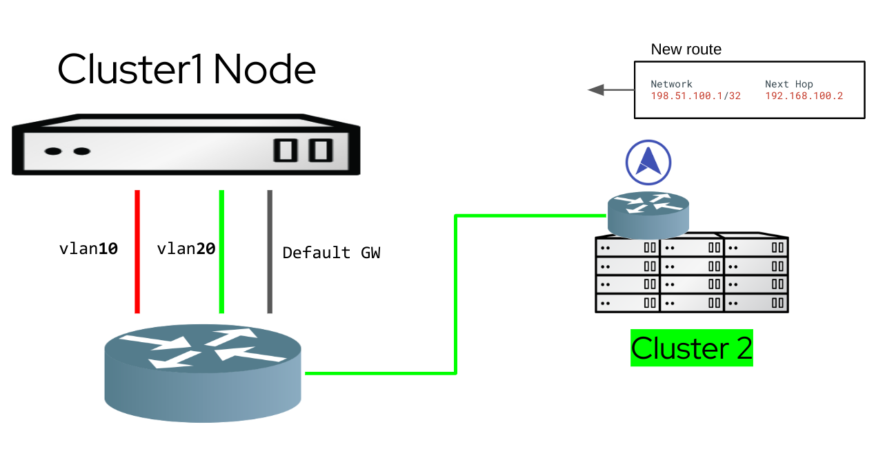
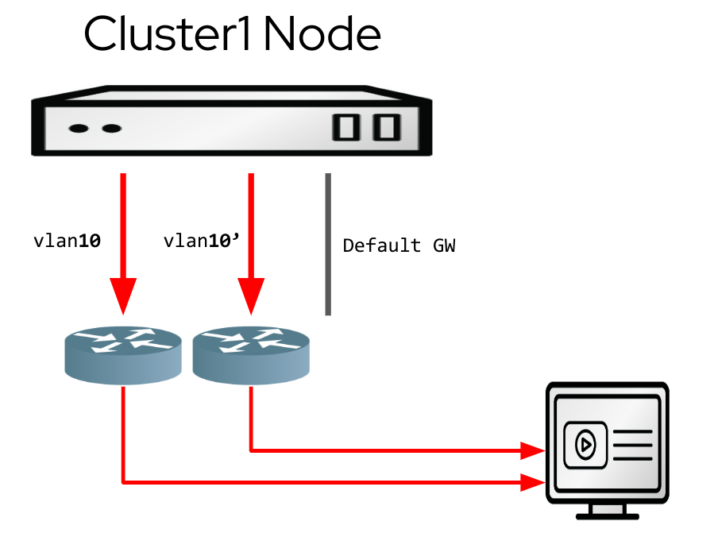
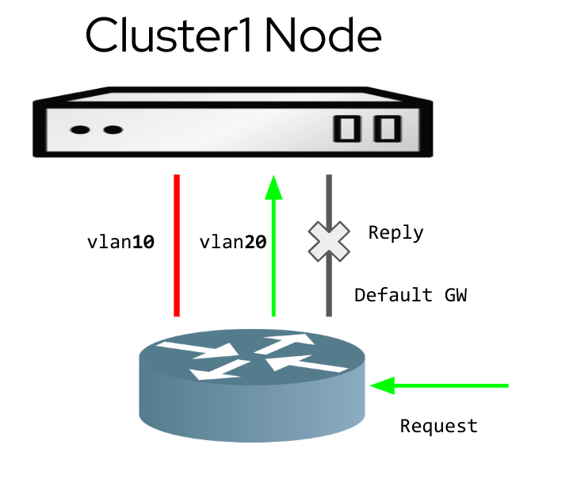

# Learning kubernetes nodes networking routes via BGP

Having the nodes of an OpenShift (or Kubernetes) cluster able to learn routes via BGP is a popular ask.

In simple scenarios where the cluster nodes have one single interface (and default gateway) everything is simple, because
there are no exceptions to the default route.

However, when we have nodes with multiple interfaces, we might face the following scenarios

### Dynamic routing

The network fabric around the cluster is complex, and some services are reacheable via different interfaces
(for example, services of type LoadBalancer announced by other Kubernetes clusters living on different networks).



### Traffic segregation

Different external services are reacheable via different node interfaces, because of traffic segregation requirements.
The traffic directed to a given CIDR must be sent via a specific network interface (typically, a vlan corresponding
to a VRF in the router). Setting static routes simply does not scale.


### Multiple Gateways

the users want to achieve some kind of high availablity for the egress traffic, having multiple DCGWs in an active - active configuration



### Asymmetric return path

the nodes do not have a route to reach the client, so the return traffic goes via the default gateway. The node must know the path to the client to send the return traffic to a given request via the right interface



All these problems can be solved by allowing external routers to push routes to the node's host networking space via
BGP.

## Using MetalLB to receive routes

MetalLB leverages the [FRR stack](https://frrouting.org/) to advertise Kubernetes services of type
LoadBalancer via BGP.

Despite having an FRR instance running on each node of the cluster, such instance can't be used for
purpouses that go beyond the very specific MetalLB use case.

## Allowing the FRR instance coming with MetalLB to receive the routes

The way MetalLB works is by translating its configuration described with Kubernetes CRDs to a raw FRR configuration.
What MetalLB now allows to do is to provide a raw configuration that can be appended to the one rendered by MetalLB.

The FRR instance running inside MetalLB does not allow incoming routes to be propagated because of a generated rule like:

```bash
route-map 192.168.1.5-in deny 20
```

The rule is named after the IP of the neighbor configured in the BGPPeer instance.

### Using a custom config to remove the deny rule

In order to enable FRR to receive the routes via BGP, a configmap as follows must be configured:

```yaml
apiVersion: v1
kind: ConfigMap
metadata:
  namespace: metallb-system
  name: bgpextras
data:
  extras: |
    route-map 192.168.1.5-in permit 20
    route-map fc00:f853:ccd:e793::5-in permit 20
```

With one line per configured peer. This will override the deny rule put in place by MetalLB and the FRR instance will be able to receive the
routes.

### Filtering the incoming prefixes

The only extra piece of allowed frr configuration is:

- custom prefix-lists not overlapping with the ones generated by MetalLB (with a custom name)
- a route map per router, under the form "route-map xxxx-in permit 20" (with the same 20 index, to override the one MetalLB puts in place)
- a match rule for the route map, matching the aforementioned prefix list

Here follows an example of the configuration:

```bash
ip prefix-list filtered permit 172.16.1.0/24 le 32
ip prefix-list filtered permit 172.16.2.0/24 le 32

route-map xxxx-in permit 20
  match ipv4 address prefix-list filtered
```

### Availability

This particular configuration is available in the upstream version of MetalLB [https://metallb.universe.tf/]
and in Openshift 4.12+ as Tech Preview.

### Known issues

Because of this FRR bug [bugzilla.redhat.com/show_bug.cgi?id=2185804](bugzilla.redhat.com/show_bug.cgi?id=2185804), the configuration must be in place before MetalLB establishes a session. This means that the configmap must be created before the BGPPeer CRDs are, or that the speaker pods must be restarted if the configmap is created after the session was already established.
The bug is not present in 4.14 where a more recent version of FRR is being used.

## What's next

This is a quick solution to enable the requirement of the users. However, MetalLB's purpouse is not really receiving routes. On the other hand, running multiple FRR instances on the same node has other challenges and
is a waste of resources.

Because of this, we are re-architecting MetalLB in such a way that FRR will run as a separate instance with
its own API that can be contributed both by MetalLB, by the user or by other controllers.


Having a single FRR instance on each node is the best way to optimize both node resources and router resources, as the various configurations will be able
to share the same BGP / BFD session.

For more details, the upstream design proposal is available [here](https://github.com/metallb/metallb/blob/main/design/splitfrr-proposal.md) and is currently being worked on.
